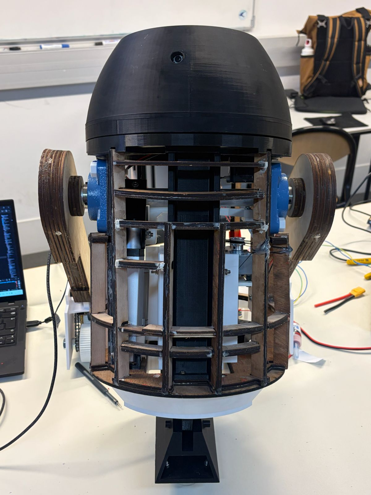

# R1-C4 – Experimental Assistant Robot

  

R1-C4 is an experimental assistant robot project inspired by the R2-D2 universe and developed at **Polytech Nice Sophia** as part of the **Experimental Robotics** course.

The project can be developed throughout the three years of the engineering cycle. I am currently in the **second year of development** of R1-C4.

The objective is to progressively design, prototype and improve a functional assistant robot at approximately **3/5 scale**, combining mechanical design, embedded systems, 3D printing, electronics, actuation and autonomous functions.

---

## Contents

- [Project Context](#project-context)
- [Project Objectives](#project-objectives)
- [Development History](#development-history)
- [Main Subsystems](#main-subsystems)
- [Design and Manufacturing](#design-and-manufacturing)
- [Documentation](#documentation)
- [Technologies](#technologies)
- [Current Development](#current-development)
- [Authorship and Credits](#authorship-and-credits)

---

## Project Context

R1-C4 was started during my **3rd year of engineering studies** at Polytech Nice Sophia.

During the first development year, I worked on the project together with **Vladimir Grigoriev**.

My work focused mainly on:

- The **2-3-2 transformation system**
- The **central-foot lift**
- Mechanical integration
- Project cost assessment
- Global operating logic and documentation

Vladimir mainly worked on:

- The **wheel system**
- The **head / turret system**
- The first facial-recognition and tracking implementation

During my **4th year**, Vladimir moved to another robotics project and I decided to continue the development of R1-C4 independently.

The project is therefore now entering a new development phase focused on redesigning, improving and integrating the different subsystems into a more robust and complete robot.

---

## Project Objectives

The main objective of R1-C4 is to develop a semi-autonomous assistant robot inspired by the architecture and motion of R2-D2.

The project explores several engineering areas:

- Mechanical design and CAD
- Embedded electronics
- Robotics integration
- Actuator control
- Computer vision
- 3D printing
- Experimental prototyping
- System-level design

The robot is designed at approximately **3/5 scale**.

Reference dimensions from the **R2 Builders community** were used as a basis for defining the overall proportions of the robot before adapting them to the selected scale and project constraints.

---

## Development History

### First Development Year

The first year focused on validating the main mechanical and functional principles of the robot.

A first prototype was built using a wooden chassis inspired by existing R2-D2 construction approaches.

This phase made it possible to develop and test:

- A functional 2-3-2 body inclination mechanism
- A first central-foot lift
- An initial wheel system
- A rotating head
- Facial recognition and user tracking
- Initial embedded-electronics integration

The first prototype provided an important proof of concept but also highlighted several limitations related to rigidity, precision, compactness and mechanical reliability.

More information is available in:

[**End of Year 1 – Project Status**](docs/year-1-status/)

### Second Development Year

The second year focuses on redesigning and improving the robot based on the limitations identified during the first prototype phase.

Current work includes:

- Redesign and manufacturing of the new chassis
- Redesign of the central-foot lift
- Refinement of the 2-3-2 system
- Complete redesign of the wheel system
- Reorganisation of the electronics
- Adaptation of the facial-recognition system
- Improved integration of the different subsystems

---

## Main Subsystems

### 2-3-2 Transformation System

The 2-3-2 mechanism controls the inclination of the robot body and allows R1-C4 to transition between an upright configuration and a three-wheel driving configuration.

The system uses a linear actuator and lever mechanism to control body inclination.

[**Explore the 2-3-2 system →**](2-3-2-system/)

---

### Central-Foot Lift

The central-foot lift vertically deploys and retracts the robot's central foot.

The current redesign uses linear guidance, reinforced structural parts and a more compact architecture to improve mechanical stability.

The central foot is also equipped with ball-transfer units, allowing it to roll freely while the robot moves.

[**Explore the central-foot lift →**](central-foot-lift/)

---

### Chassis

The first chassis was manufactured in wood and used as a functional prototype.

After identifying limitations in rigidity, dimensional accuracy and ease of modification, the chassis was completely redesigned in CAD and manufactured by FDM 3D printing using PETG.

The new modular chassis is divided into several sections to simplify manufacturing, maintenance and future modifications.

[**Explore the chassis →**](chassis/)

---

### Wheel System

The first wheel system was developed during the first development year and was mainly designed by **Vladimir Grigoriev**.

Although it enabled initial driving tests, the mechanism progressively became unreliable and ultimately required a complete redesign.

The complete wheel architecture is therefore being redesigned during the second development year.

[**Explore the wheel system →**](wheel-system/)

---

### Head and Turret

The head/turret system combines facial recognition, target tracking and independent head rotation.

The first version included:

- LBPH facial recognition
- CSRT tracking
- Kalman filtering
- Stepper-motor-controlled head rotation

The first implementation was mainly developed by **Vladimir Grigoriev**.

Current work focuses on reorganising the electronics and adapting the facial-recognition system for continued development.

[**Explore the head and turret system →**](head-turret/)

---

## Design and Manufacturing

The project follows an iterative prototyping methodology:

1. Research existing solutions
2. Develop an initial concept
3. Build and test a functional prototype
4. Identify mechanical and integration limitations
5. Redesign the subsystem
6. Manufacture and test the improved version

Mechanical parts are designed primarily using **Fusion 360**.

Many structural components are manufactured by FDM 3D printing using **PETG** on:

- Prusa MK4
- Prusa XL

Printing parameters are adapted according to the mechanical role and geometry of each component.

---

## Documentation

The `docs/` folder contains the general engineering documentation associated with the project.

It includes:

- [Preliminary Research](docs/preliminary-research/)
- [End of Year 1 – Project Status](docs/year-1-status/)
- [Project Cost Assessment](docs/cost-assessment/)
- [Global Operating Algorithm](docs/operating-algorithm/)
- [Electronic Architecture](docs/electronic-architecture/)

---

## Technologies

- Fusion 360
- CAD modelling
- C / C++
- ESP32
- Jetson Nano
- Embedded systems
- Computer vision
- OpenCV
- 3D printing
- PETG
- Mechanical design
- Actuator control
- Sensor and system integration
- Experimental robotics

---

## Current Development

R1-C4 is still an active project.

Current priorities include:

- Completing the new chassis integration
- Finalising the redesigned central-foot lift
- Redesigning the wheel system
- Reorganising the electronics
- Improving system reliability
- Continuing vision and tracking development
- Preparing the robot for controlled movement
- Progressively introducing more autonomous behaviours

The repository will evolve alongside the physical robot as new components are designed, manufactured and tested.

---

## Authorship and Credits

The first development year of R1-C4 was carried out in collaboration with **Vladimir Grigoriev**.

His contributions are identified in the relevant sections of this repository.

Unless otherwise stated, the **CAD models, images, videos, documentation and other resources shared in this repository are my own work**.

---

## Author

**E. Da Mota**  
Engineering student – Autonomous Robotics  
Polytech Nice Sophia – Université Côte d’Azur