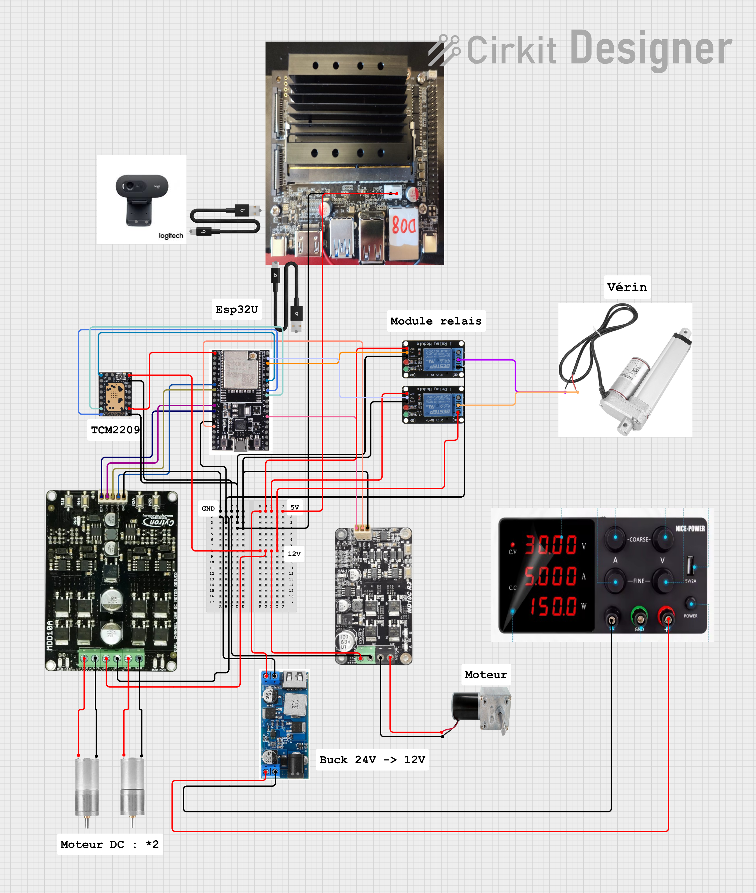

# Electronic Architecture

This diagram presents the overall electronic architecture developed for R1-C4 during the first development year.

The objective was to define how the main computing, control, power and actuation components would be interconnected within the robot.

## Main Components

The architecture includes several key elements:

- **Jetson Nano** for high-level processing and vision-related tasks
- **ESP32** for embedded control and communication with the actuators
- **TMC2209 stepper motor driver** for head rotation
- **Dual DC motor driver** for the two main drive motors
- **Relay modules** for controlling the linear actuator
- **DC-DC buck converter** for voltage adaptation
- **Power supply** for the complete system
- **Linear actuator** for the 2-3-2 transformation mechanism
- **DC motors** for robot movement
- **Lift motor** for the central-foot lift system
- **Webcam** for visual input

## System Organisation

The Jetson Nano acts as the main computing platform for higher-level functions such as image processing and user tracking.

The ESP32 is used for lower-level control and interfaces with the motor drivers, relays and other actuators.

The power stage distributes the required voltages to the different components. A DC-DC converter is used to reduce the supply voltage for components requiring a lower operating voltage.

The relay modules are used to control the linear actuator, while dedicated motor drivers handle the different DC and stepper motors.

## Purpose of the Diagram

This architecture diagram was created to visualise the interactions between the main electronic components before full integration inside the robot.

It also helped organise the distribution of power, control signals and actuator connections within R1-C4.

