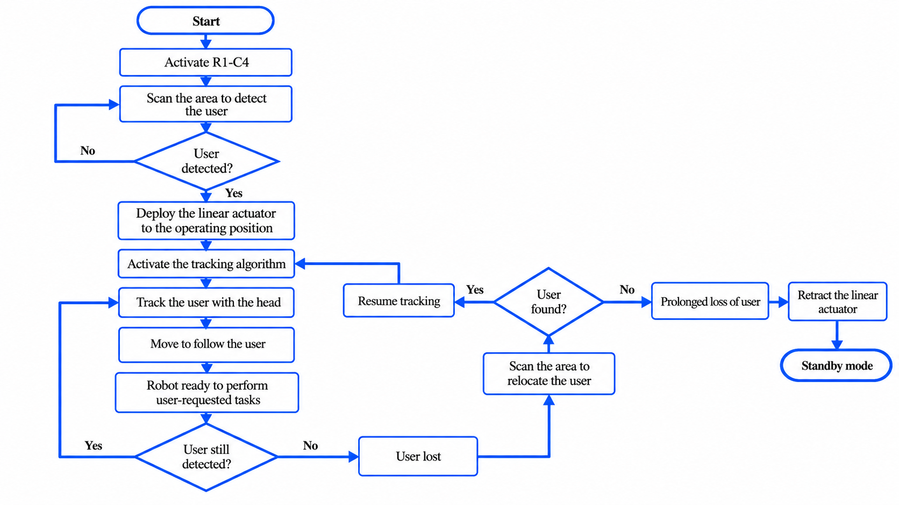

# Global Operating Algorithm

A global operating algorithm was developed during the first year of the R1-C4 project to define how the robot's main functions interact.

The objective was to establish a logical sequence for the robot's behaviour before implementing all of the autonomous functions.

## General Principle

The algorithm connects the main subsystems of R1-C4, including:

- User detection and facial recognition
- Head orientation and target tracking
- Robot movement
- 2-3-2 transformation
- Central-foot control
- Sensor and actuator management

The global architecture was designed to coordinate perception, decision-making and mechanical actions within the robot.

## Vision and Tracking

The vision system was designed to detect and recognise a user before tracking their movement.

The initial approach combined:

- LBPH facial recognition
- CSRT real-time tracking
- Kalman filtering for motion prediction

The Jetson Nano processes the visual information and sends correction commands to the ESP32, which controls the corresponding actuators.

## Role in the Project

Creating the operating algorithm helped define the interactions between the different subsystems before full integration.

It also provided a common reference for the mechanical, electronic and software development of R1-C4.

## Operating Flowchart

The global operating flowchart developed during the first year is shown below:

