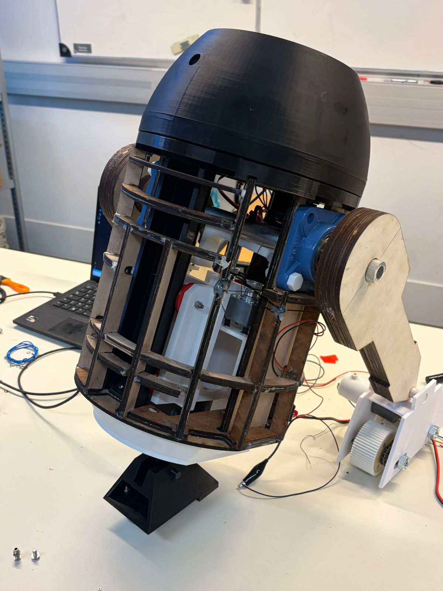

# End of Year 1 – Project Status

At the end of the first development year, R1-C4 had reached the stage of a functional prototype.

The first year focused mainly on the mechanical architecture of the robot, while also introducing the first elements of embedded electronics, vision and autonomous behaviour.

This stage made it possible to validate several key subsystems and identify the main technical limitations to address during the following development year.

## Functional Systems

By the end of the first year, the following elements had been implemented or validated:

- 2-3-2 transformation mechanism
- Central-foot lift system
- Rotating head/turret
- Initial facial recognition and tracking functions
- Preliminary embedded electronics architecture

## Mechanical Development

A major part of the first development year focused on the mechanical design of R1-C4.

The **2-3-2 transformation mechanism** was developed to allow the robot to transition between a two-leg configuration and a three-wheel configuration by controlling the inclination of the body.

The **central-foot lift system** was developed as part of this transformation process, allowing the central foot to move in and out of the robot's body.

Several mechanical and structural components were designed for 3D printing, while the main chassis was still based on the original wooden prototype.

Because of the relatively large dimensions of R1-C4 and the limitations of the available printers, some large components had to be divided into several smaller parts. This reduced the risk of failed prints and made future modifications easier.

## Electronics and Control

A first embedded-electronics architecture was defined during the first year.

The system included:

- Jetson Nano for image processing and artificial intelligence
- ESP32 for central control
- Motor drivers for the different actuators
- Stepper-motor control for the head/turret
- Power conversion and distribution components

The electronic architecture was designed to remain modular and accessible in order to simplify wiring, maintenance and future integration.

## Vision and Tracking

The first version of the vision system combined:

- LBPH for facial recognition
- CSRT for real-time target tracking
- Kalman filtering for trajectory prediction

The objective was to allow the robot to recognise a user, follow their movement and send correction commands to the ESP32 in order to control the head/turret.

## Project Assessment

The first development year also included:

- A complete cost assessment of the robot
- A global operating algorithm
- A review of the initial design choices
- Identification of the main technical limitations
- Definition of the priorities for the second development year

More detailed information is available in the dedicated documentation:

- [Cost Assessment](../cost-assessment/)
- [Operating Algorithm](../operating-algorithm/)

## Lessons Learned

The first year highlighted several important design limitations.

One of the main issues concerned the central-foot lift system.

In order to save space inside the robot, the initial guiding solution was adapted with fewer contact points. This reduced the stability of the mechanism and showed that the original concept had not been sufficiently adapted to the scale and internal constraints of R1-C4.

This led to the decision to redesign the lift system during the following development year.

Another major challenge concerned the size of the structural parts. Large 3D prints were time-consuming and carried a significant risk of failure, which encouraged a more modular design approach.

## Remaining Limitations

At the end of the first year, several areas still required further development:

- The wheel system was not yet sufficiently optimised for smooth and reliable movement.
- Stability in the two-leg configuration still required improvement.
- The central-foot lift system needed to be redesigned for greater stability and compactness.
- The electronic integration still required further organisation.
- The overall appearance of the robot still reflected its prototype stage.
- Further autonomous functions remained to be developed.

## Transition to Year 2

The second development year focuses on improving the reliability, modularity and integration of R1-C4.

The main priorities include:

- Redesigning the central-foot lift system
- Redesigning the chassis
- Improving the modularity of the mechanical structure
- Redesigning the wheel system
- Improving electronic integration
- Preparing the robot for reliable movement
- Continuing the development of autonomous functions